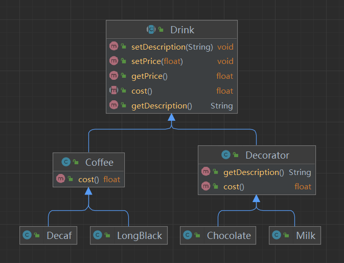
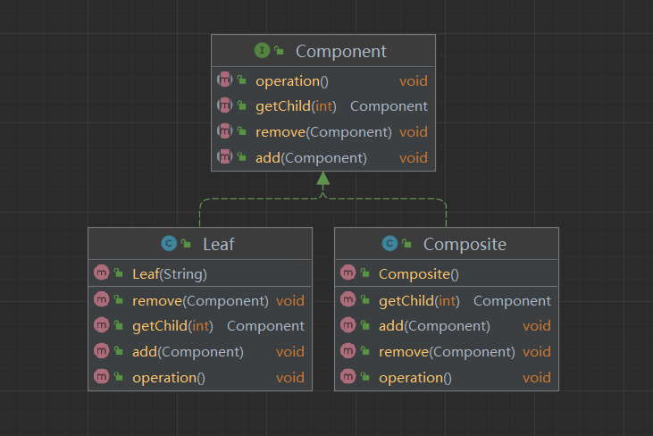
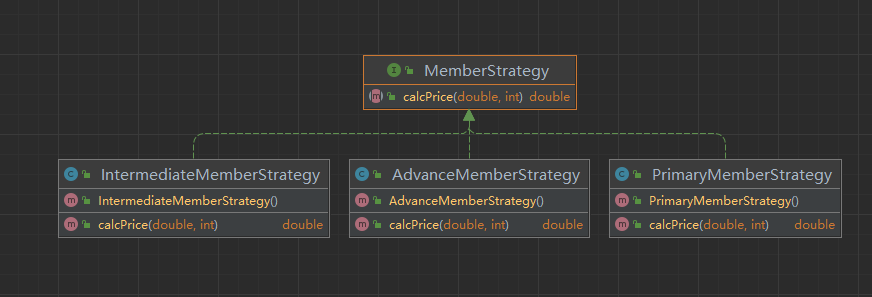
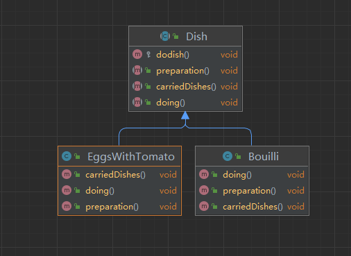

## 装饰者模式
> 装饰者和被装饰者之间必须是一样的类型,也就是要有共同的超类。
> 
>

## 代理模式
- 代理类主要负责为委托类预处理消息、过滤消息、把消息转发给委托类，以及事后对返回结果的处理等。
- 代理类本身并不真正实现服务，而是同过调用委托类的相关方法，来提供特定的服务。
- 真正的业务功能还是由委托类来实现，但是可以在业务功能执行的前后加入一些公共的服务。
- 例如我们想给项目加入缓存、日志这些功能，我们就可以使用代理类来完成，而没必要打开已经封装好的委托类。

### 动态代理
```java
Object invoke(Object proxy, Method method, Object[] args) throws Throwable
 
proxy:   指代我们所代理的那个真实对象
method:  指代的是我们所要调用真实对象的某个方法的Method对象
args:    指代的是调用真实对象某个方法时接受的参数

```

- 在需要实现动态代理的类中创建并获取动态代理对象newproxyInstance

```java
public static Object newProxyInstance(ClassLoader loader, Class<?>[] interfaces, InvocationHandler h) throws IllegalArgumentException
```
> loader:
> 一个ClassLoader对象，定义了由哪个ClassLoader对象来对生成的代理对象进行加载
 
> interfaces:
> 一个Interface对象的数组，表示的是我将要给我需要代理的对象提供一组什么接口，如果我提供了一组接口给它，那么这个代理对象就宣称实现了该接口(多态)，这样我就能调用这组接口中的方法了
 
> h:
> 一个InvocationHandler对象，表示的是当我这个动态代理对象在调用方法的时候，会关联到哪一个InvocationHandler对象上

## 组合模式(compositePattern)


## 享元模式（Flyweight）
典型为String类型，保存字符串的hash值，如果存在就直接调用该对象，若不存在则在常量池中创建


## 策略模式(StrategtPattern)

实现公共接口，然后通过环境角色(上下文角色调用 MemberContext),去除了繁杂的if...else

## 模板模式
定义公共抽象类，可以包含非抽象方法
```java
public abstract class Dish {    
    /**
     * 具体的整个过程,非抽象方法
     */
    protected void dodish(){
        this.preparation();
        this.doing();
        this.carriedDishes();
    }
    /**
     * 备料
     */
    public abstract void preparation();
    /**
     * 做菜
     */
    public abstract void doing();
    /**
     * 上菜
     */
    public abstract void carriedDishes ();
}
```

- 抽象父类（AbstractClass）：实现了模板方法，定义了算法的骨架。
- 具体类（ConcreteClass)：实现抽象类中的抽象方法，即不同的对象的具体实现细节。